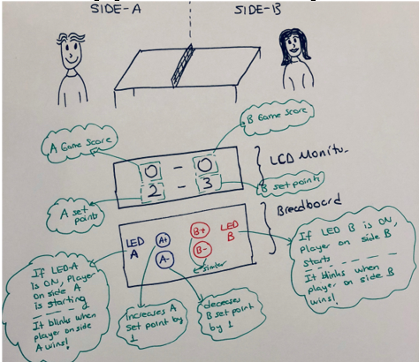
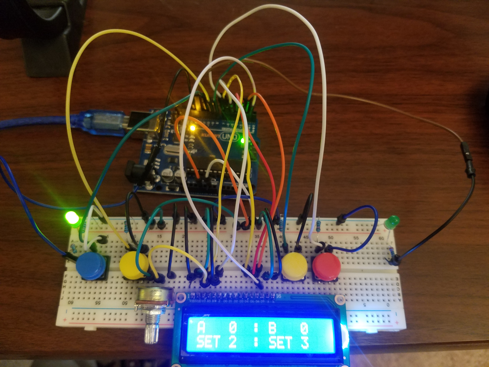
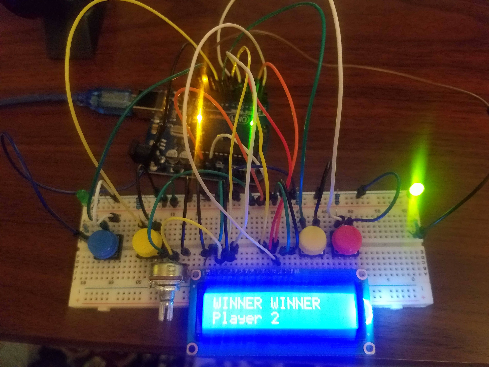

# PingPongGame_Project
## The overall Design of the accessory

# Picture of the actual Score Board Accessory

## Technologies/Tools
- Arduino Software (Arduino IDE)
- Arduino Kit(hardware)
- Arduino Code
## How to use 
- Know how to use arduino uno
- Get the arduino kits 
- Connect the electric components 
- Install Arduino Software 
- Connect your arduino circute with your computer using USB
- Then Run the given code 

